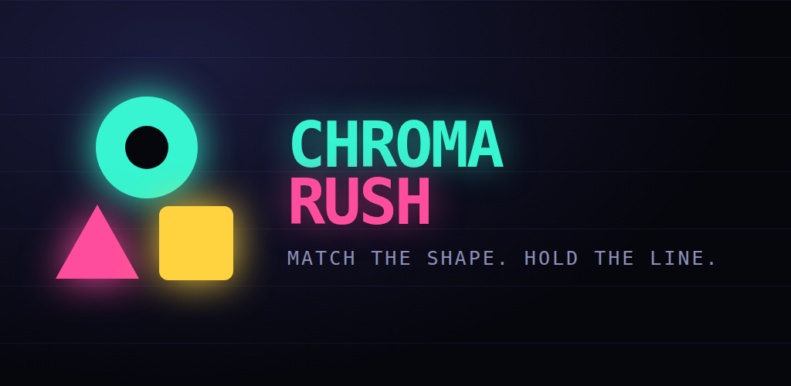

# Chroma Rush

A one-thumb arcade game built to be published on Google Play.

Three lanes, three shapes. Each gate only lets through the cell matching your
current shape; paint blobs change it; striped walls end the run. The course
accelerates until you misread one.



## Play it right now

```bash
npm run dev
```

Open http://localhost:5173. Arrow keys or A/D on desktop, tap left/right on a
phone. No build step, no dependencies.

## What's here

## Modes and progression

- **Endless** — the score chase. Procedurally generated, never the same twice.
- **Daily challenge** — one fixed course per calendar day, one attempt. The
  seed is derived from the date, so every player gets a byte-identical course
  and scores are comparable. Tracks a day streak.
- **Missions** — three rolling goals (pass N gates, hit a x4 combo, score N…)
  that pay out coins and reroll. Targets scale with how much you've played, so
  a new player is never handed a goal they can't reach.
- **Near-miss feedback** — a run that lands within 15% of your best says how
  many points short it was, because that's the moment people tap Play Again.

```
www/                the whole game (plain HTML/CSS/JS, zero dependencies)
  index.html        shell + DOM overlay screens
  styles.css        UI, safe-area aware, portrait-first
  js/game.js        gameplay, collision, rendering
  js/level.js       procedural course generation
  js/ui.js          screens, HUD, theme shop
  js/ads.js         AdMob bridge (placeholder ads in the browser)
  js/audio.js       all sound, synthesized — no audio files
  js/storage.js     save data
  js/skins.js       the six themes
  js/daily.js       daily challenge seeding and streaks
  js/missions.js    rolling goals and payouts
store/              Play Store icon, feature graphic, screenshots, listing copy
docs/               setup, publishing, monetization, privacy policy
tools/dev-server.js zero-dependency static server
```

## How the course generation works

`level.js` walks a **solution path** forward. It always knows which lane and
shape the player can be in when the next gate arrives, and builds the gate
around that — the paint blob is only ever placed where the path actually
reaches it. An unwinnable gate can't be generated.

Verified by a bot that plays the solution path: it survives to maximum
difficulty (speed 770, 59+ gates) with zero deaths.

## Shipping it

1. **[docs/ANDROID_SETUP.md](docs/ANDROID_SETUP.md)** — wrap it with Capacitor,
   build a signed AAB
2. **[docs/PUBLISHING.md](docs/PUBLISHING.md)** — Play Console, the forms, and
   the 12-tester rule that catches people out
3. **[docs/MONETIZATION.md](docs/MONETIZATION.md)** — AdMob wiring, and honest
   numbers on what it earns

## Tuning the difficulty

Everything lives in `level.js`:

| What | Where |
|---|---|
| How fast it ramps | `difficulty` — `passed / 80` |
| Speed range | `speed` — `lerp(215, 700, d)` |
| Reaction time | `gap` — `lerp(1.55, 0.72, d)` seconds between gates |
| When walls start | `wallChance` — nothing before 12 gates passed |
| When shape changes start | `changeChance` — nothing before 4 gates passed |
| Free second safe cell | `mercyChance` — guaranteed for the first 6 gates |

Difficulty is keyed to gates **passed**, not gates spawned. The generator runs
about six gates ahead, so keying it to spawns ran the course ~17% hotter than
the numbers above suggest.

Playtest after changing any of them — small changes here move the difficulty
curve a lot.

## License

MIT. The code is yours to ship, sell, and modify.
